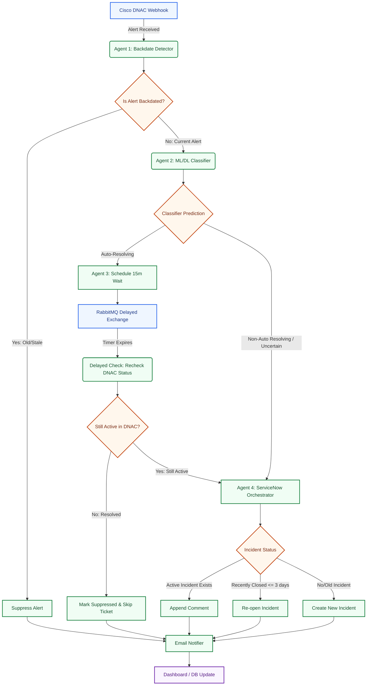

# Control Flow Architecture

This diagram illustrates the logical decision path and processing stages that an alert passes through, from ingestion to final resolution or ticketing.

### Flow Breakdown

1. **Ingestion & Validation**: Cisco DNA Center pushes live alert webhooks.
2. **Backdate Check (Agent 1)**: If the alert timestamp is older than 24 hours (backdated), it is suppressed immediately.
3. **Classification (Agent 2)**: For fresh alerts, Agent 2 runs the TF-IDF and DistilBERT models to predict if the issue is a transient, self-healing event.
4. **Delayed Mitigation (Agent 3)**: Auto-resolving alerts are sent to a 15-minute wait queue. After the delay, the system queries DNAC to verify if the alert is still active before taking action.
5. **Escalation (Agent 4)**: Alerts classified as critical or still active after the delay queue generate a ticket in ServiceNow.
