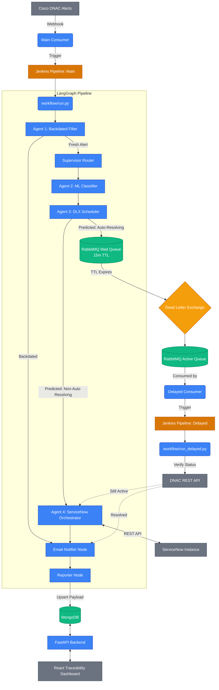

# False Alert Suppression: Architecture Design Document

This document outlines the complete end-to-end architecture of the False Alert Suppression system, integrating LangGraph, RabbitMQ, MongoDB, ServiceNow, and the React Traceability Dashboard.

## System Architecture Diagram

---

## Component Breakdown

### 1. LangGraph Pipeline (The Brain)
The core intelligence of the system is built using LangGraph, utilizing distinct node-based agents to evaluate alerts sequentially.
- **Agent 1 (Backdated Filter)**: Evaluates the timestamp of the incoming alert. If the alert is significantly older than the current time, it is flagged as `backdated` and immediately bypassed/suppressed.
- **Agent 2 (ML Classifier)**: Uses Machine Learning algorithms to analyze the alert payload (Issue description, severity, facility) and categorizes it as either `Auto resolving` or `Non-Auto Resolving`.
- **Agent 3 (DLX Scheduler)**: Intercepts `Auto resolving` alerts and pushes their entire payload into a RabbitMQ Dead-Letter Exchange (DLX) delay queue. It effectively pauses the lifecycle of the alert for 15 minutes.
- **Agent 4 (ServiceNow Orchestrator)**: Intercepts `Non-Auto Resolving` alerts (or delayed alerts that failed to resolve). It dynamically queries ServiceNow to append comments to active incidents, re-open recently closed incidents (<= 3 days), or create net-new incidents.
- **Email Notifier Node**: Intercepts the flow just before the reporter to send configurable email notifications to a DL if specific suppression or escalation thresholds are met.
- **Reporter Node**: The terminal node that collects the execution traces of all previous agents and persists the final state payload.

### 2. Event-Driven Delay Mechanism & Orchestration (RabbitMQ & Jenkins)
To gracefully handle "Auto resolving" alerts without locking up compute threads, the system utilizes a RabbitMQ DLX architecture coupled with Jenkins orchestration.
- **Wait Queue (`wait.q`)**: Configured with a strict 15-minute Time-To-Live (`x-message-ttl`). No consumers listen to this queue.
- **Dead-Letter Exchange (`dnac.exchange`)**: When the 15-minute timer expires, RabbitMQ evicts the message and routes it through this exchange.
- **Consumer Daemons**: Python processes (`noops_dnac_consumer.py` and `consumer-delay-queue.py`) that listen to the queues. Instead of processing logic directly, they trigger **Jenkins Pipelines** (`jenkins/Jenkinsfile.main` and `jenkins/Jenkinsfile.delayed`).
- **Jenkins Orchestration**: Provides a robust, scalable, and isolated execution environment for the LangGraph pipeline, ensuring dependency management, artifact archiving, and clear execution traces. `run_delayed.py` explicitly verifies the current alert status with DNAC; if still active, it triggers **Agent 4** to escalate it to an incident.

### 3. Traceability & Persistence Layer
- **MongoDB**: The `Reporter` node seamlessly upserts every completed alert lifecycle (including the original payload, ML classification, and ServiceNow actions) into a NoSQL document database.
- **FastAPI Bridge**: A lightweight, asynchronous REST API (`api.py`) exposes the MongoDB data to the frontend, incorporating a real-time bulk-fetch integration with ServiceNow (`get_incidents_by_numbers`) to display live incident states.
- **React Dashboard**: A visually stunning Vite/React SPA utilizing Glassmorphism design and Recharts. It polls the FastAPI bridge every 15 seconds to provide engineers with real-time volumetrics, historical trends, and an interactive traceability matrix for every alert.
